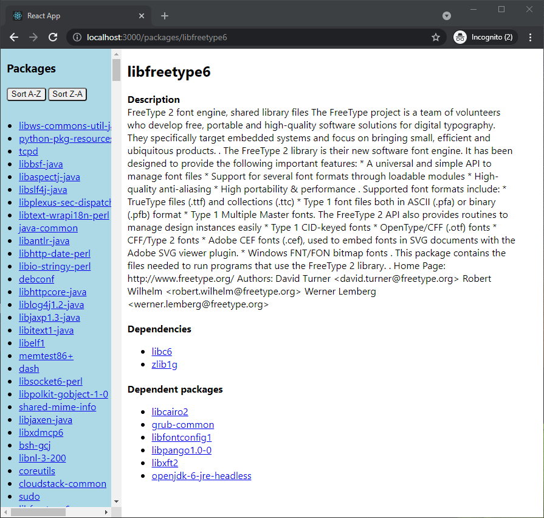

# dpkg-status-ui

A React+Node+Express application showing packag information extracted from `/var/lib/dpkg/status` file found in Debian and
Ubuntu systems via web ui.



## Requirements


## Getting started

Clone the project:

```
git clone https://github.com/hzski2008/dpkg-status-ui
```

Install dependencies:
```
cd backend && npm install
cd frontend && npm install
```

## Get it up and running

#### In development, the client and server runs on different port

Run the server
```
npm run start:dev-server
```

Run the UI
```
npm run start:dev-ui
```

You can now acess the UI on <http://localhost:3000>, which connects to backend server on <http://localhost:3001>

#### In production, the client and server runs on the same domain
```
npm run build && npm run start:prod
```

You can now access the whole app on <http://localhost:3001>

